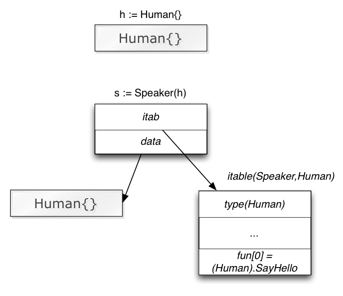
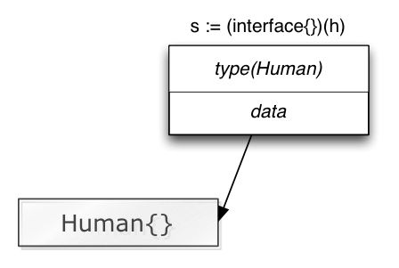

# 1.  **Типы данных в Go**
**Целые числа** (int архитектурно-зависимый)  
Архитектурно-независимые типы целых чисел:  
- uint8       unsigned  8-bit integers (0 to 255)
- uint16      unsigned 16-bit integers (0 to 65535)
- uint32      unsigned 32-bit integers (0 to 4294967295)
- uint64      unsigned 64-bit integers (0 to 18446744073709551615)
- int8        signed  8-bit integers (-128 to 127)
- int16       signed 16-bit integers (-32768 to 32767)
- int32       signed 32-bit integers (-2147483648 to 2147483647)
- int64       signed 64-bit integers (-9223372036854775808 to 9223372036854775807)

**Числа с плавающей точкой** (float архитектурно-зависимый)  
Архитектурно-независимые типы чисел с плавающей точкой:   
- float32     IEEE-754 32-bit floating-point numbers
- float64     IEEE-754 64-bit floating-point numbers
- complex64   complex numbers with float32 real and imaginary parts
- complex128  complex numbers with float64 real and imaginary parts

Также существует несколько типов псевдонимов чисел, которые присваивают полезные имена определенным типам данных:
- byte        alias for uint8 (используется для бинарных данных)
- rune        alias for int32 (используется для представления Юникода)

Тип данных **boolean** может иметь значение истина или ложь и определяется как bool при декларировании.

# 2. **Что из себя представляет тип данных string в языке Golang? Можно ли изменить определенный символ в строке? Что происходит при склеивании строк?**
string в GO это read-only slice байт (строки неизменяемый тип данных). В стоке можно получить конкретный символ по индексу (но не изменить). Также можено получить подстроку с помощью среза. При склеивании двух строк получится новая строка.

# 3. **Массивы в Go**
Массив — это нумерованная последовательность элементов одного типа с фиксированной длиной. Массив это изменяемый тип данных.  
По определению тип массива состоит из длины и типа его элементов. Например, тип [4]int представляет массив из четырёх целых чисел. Размер массива неизменяем; его длина - это часть его типа ([4]int и [5]int различные, несовместимые типы). Массивы могут быть проиндексированы, поэтому с помощью выражения s[n] мы получаем доступ к n-ному элементу, начиная с нуля.  
Представление [4]int в памяти - это просто четыре целых значения, расположенных последовательно.  
Пример:  
```go
coral := [4]string{"blue coral", "staghorn coral", "pillar coral", "elkhorn coral"}
```
Массивы в Go и есть значения. Переменная с именем массива обозначает весь массив,  
это не указатель на первый элемент (как это было бы в случае С).  
Это значит, что когда вы присваиваете значение или проходитесь по массиву,  
вы будете делать копию его содержимого (для избежания копирования, вы могли бы передавать указатель на массив,  
но тогда это будет указатель на него, а не сам массив).  
Один из способов представить массив - это будто массив является как бы структурой,  
но с нумерованными, а не именованными полями: составное значение фиксированного размера.  

# 4. **Cлайсы и их устройство в Go. Функции append() и cpoy() и их особенности**
Чтобы постоянно не копировать все элементы массива в Го придуман слайс — абстрактный тип над массивом, состоящий из:

- ссылки на массив
- (len) размера слайса — количество инициализированных элементов
- (cap) ёмкость слайса — размер, до которого можно увеличить слайс, без пересоздания массива  

```go
type slice struct {
    array unsafe.Pointer
    len   int
    cap   int
}
```

Когда превышается ёмкость, в памяти выделяется массив большей длины, в него копируется старый, а в слайсе обновляется ссылка.  
**zero value для слайса это nil** len = 0, cap = 0  

```go
foo = make([]int, 5)
```
Эта команда создаст сначала массив из 5 элементов типа int (выделит память и заполнит их нулями zero value for int), и установит значения len и cap в 5. Cap означает ёмкость и помогает зарезервировать место в памяти на будущее, чтобы избежать лишних операций выделения памяти при росте слайса. Можно использовать чуть более расширенную форму — make([]int, len, cap), чтобы указать ёмкость изначально.

Пример ниже демонстрирует, что модифицируя слайс bar, мы, на самом деле, изменяем массив (который заложен в основу слайса foo)  
```go
foo := make([]int, 5)
foo[3] = 42
foo[4] = 100

fmt.Println(foo) // [0 0 0 42 100]

bar := foo[1:4]
bar[1] = 99999
bar = append(bar, 555)
fmt.Println(bar) // [0 99999 42 555]
fmt.Println(foo) // [0 0 99999 42 555]
```
Функция append() проверяет, достаточно ли у слайса места, чтобы добавить туда ещё элемент, и если нет, то выделяет больше памяти. Выделение памяти это всегда дорогая операция, поэтому append() пытается оптимизировать это, и запрашивает в данном случае памяти не для одной переменной, а в два раза больше, чем начальный размер. Выделение памяти пачкой один раз дешевле, чем много раз по кусочкам. append() увеличивает слайс удвоением только до 1024 байт, а затем начинает использовать другой подход — так называемые "классы размеров памяти", которые гарантируют, что будет выделяться не более ~12.5%. Выделять 64 байта для массива на 32 байта это нормально, но если слайс размером 4ГБ, то выделять ещё 4ГБ даже если мы хотим добавить лишь один элемент — это чересчур дорого.  

Функция append() не изменяет переданный в аргументах срез, а возвращает новый.  
Если мы присвоим результат выполнения этой функции в новый срез, то увидим что старый не изменился.  

**Проблема в том, что выделение памяти обычно означает выделение её по другому адресу и перемещение данных из старого места в новое. Это означает, что адрес массива, на который ссылается слайс также изменится!**

```go
a := make([]int, 32)
b := a[1:16]
a = append(a, 1)
a[2] = 42
```
Именно так, мы получим два различных массива, и два слайса будут указывать на совершенно разные участки памяти!  
Поэтому, как правило, если вы вы работаете с append() и подслайсами — будьте осторожны и имейте ввиду эту особенность.  

Встроенная функция **copy()** копирует элементы в целевой срез dst из исходного среза src.
```go
func copy(dst, src []Type) int
```
Возвращает количество скопированных элементов, которое будет минимумом len(dst) и len(src). Результат не зависит от того, перекрываются ли аргументы.  
Как особый случай, законно копировать байты из строки в срез байтов.  
```go
copy(dst []byte, src string) int
```
Поскольку срез — это указатель, при передаче его в функцию он передается по  
ссылке. То есть, мы работаем с той же областью в памяти, в которой хранятся  
значения массива, на который ссылается срез.  
Изменяя внутри функции переданный срез, мы тем самым изменяем исходный срез.  
И еще. Поскольку мы изменяем указатель на массив внутри функции, то и сам этот массив должен измениться.  
**Давайте резюмируем**  
Массив — это последовательность элементов одинакового типа фиксированной длинны.  
Срез в свою очередь такой же массив, только его длинна динамична.  
Срез является указателем на массив. Изменения элементов среза изменяют массив,  
на который он ссылается, и наоборот. Для итерации по срезам и массивам мы используем цикл for.  
У пустого массива все его элементы равны нулевому значению. Пустой срез  
равен nil , т.к указатель на массив среза пустой. 

# 5. **Структуры и ООП**
Go можно назвать объектно-ориентированным языком, хоть в нем и нету привычных
для такого семейства языков классов. Вместо них в Go используются структуры,
которые умеют в себе хранить набор разных типов данных.

Структура имеет возможность хранить в себе множество различных типов данных и
может описывать какую-либо сущность из реального мира, ее характеристики (поля)
и поведение (методы).

Конструкторы (инициализаторы) обычно выглядят как newНазваниеСтруктуры()  
и возвращают новый объект самой структуры. Конструкторы пришли к нам из мира ООП,  
и по своей сути, не являются обязательной частью программы на Go.  
Однако, такой подход можно назвать хорошей практикой,  
и вы точно столкнетесь с такой конструкций в большинстве проектов.  

Пример: объявление структуры Circle, объявление ее метода area(), инициализация и вызов метода  
```go
type Circle struct {
    x, y, r float64
}

func (c *Circle) area() float64 {
    return math.Pi * c.r*c.r
}

c := Circle{0, 0, 5}
fmt.Println(c.area())
```

# 6. **Интерфейсы и их устройство. Пустой интерфейс. Интерфейсы и ООП.**
**Интерфейс** — это абстрактный тип, который описывает поведение, но не реализовывает его.  
Интерфейсы описывают абстракцию (обобщают) поведение других типов. С помощью  
обобщения интерфейсы позволяют писать более гибкие и адаптируемые функции, не  
привязанные к деталям одной конкретной реализации.  
Структуры и типы могут реализовывать (или имплементировать) некий интерфейс.  
Тип соответствует (удовлетворяет) интерфейсу, если он обладает всеми методами,  
которые требует интерфейс.  
**Структура хранит данные, но не поведение. Интерфейс хранит поведение, но не данные.**  

Поскольку интерфейсы, это такие же кастомные типы, как и структуры, мы можем создавать переменные данного типа.  
После создание пустой переменной типа нашего интерфейса, ее значение равно nil (zero value) и ее тип также равен nil.  
Концептуально значение интерфейсного типа, или просто значение интерфейса,  
имеет два компонента — конкретный тип и значение этого типа.  
Они называются **динамическим типом** и **динамическим значением** интерфейса.  

В Go мы можем присваивать в переменную интерфейса другие типы, которые  
соответствуют данному интерфейсу. Как только значение интерфейса становиться  
не nil , его динамический тип становится типом нового значения.  

Свобода замены одного типа другим, который соответствует тому же интерфейсу,  
называется взаимозаменяемостью (substitutability) и является отличительной
особенностью объектно-ориентированного программирования.  

Если 2 структуры, реализовывают один и тот же интерфейс, то это называется **полиморфизмом**  
**Полиморфизм** — возможность объектов с одинаковой спецификацией иметь
различную реализацию. Его смысл можно выразить фразой: «Один интерфейс,
множество реализаций».

## Внутреннее устройство
В исходниках Go: 
```go 
type iface struct {
    tab  *itab
    data unsafe.Pointer
}
```
Пример:  


- tab — это указатель на Interface Table или itable — структуру, которая хранит некоторые метаданные о типе и список методов, используемых для удовлетворения интерфейса
- data — указывает на фактическую переменную с конкретным (статическим) типом

      Теперь несколько слов про itable. Поскольку эта таблица будет уникальна для каждой пары интерфейс-статический тип, то просчитывать её на этапе компиляции (early binding) будет нерационально и неэффективно.

      Вместо этого, компилятор генерирует метаданные для каждого статического типа, в которых, помимо прочего, хранится список методов, реализованных для данного типа. Аналогично генерируются метаданные со списком методов для каждого интерфейса. Теперь, во время исполнения программы, runtime Go может вычислить itable на лету (late binding) для каждой конкретной пары. Этот itable кешируется, поэтому просчёт происходит только один раз.

      Зная это, становится очевидно, почему Go ловит несоответствия типов на этапе компиляции, но кастинг к интерфейсу — во время исполнения. Не забывайте, что именно для того, чтобы безопасно ловить ошибки приведения к интерфейсным типам, существует конструкция comma-ok — if s, ok := h.(Speaker); !ok { ... }.

## Пустой interface{}
Теперь вспомним про так называемый пустой интерфейс (empty interface) — interface{}, которому удовлетворяет вообще любой тип. Поскольку у пустого интерфейса нет никаких методов, то и itable для него просчитывать и хранить не нужно — достаточно только метаинформации о статическом типе. Это интерфейс, который вообще не описывает никакого поведения.  

Поэтому в памяти пустой интерфейс выглядит примерно так:  
  
Теперь, каждый раз, когда вы захотите воспользоваться пустым интерфейсом — помните. что он ничего не означает.  
Никакой абстракции. Это невидимый плащ над вашим конкретным типом, который прячет от вас конкретику,  
и не даёт никакого понимания о поведении. Именно поэтому использовать пустые интерфейсы нужно в самых крайних случаях.  
### [Краш-курс по интерфейсам в Go](https://habr.com/ru/post/276981/)
### [Крутая статья про интерфейсы от mail.ru](https://habr.com/ru/company/mailru/blog/490340/)

# 7. **Как устроен тип map? Какая hash-функция используется в map в Go? Что такое bucket? Race condition в map. Каков порядок перебора map?**