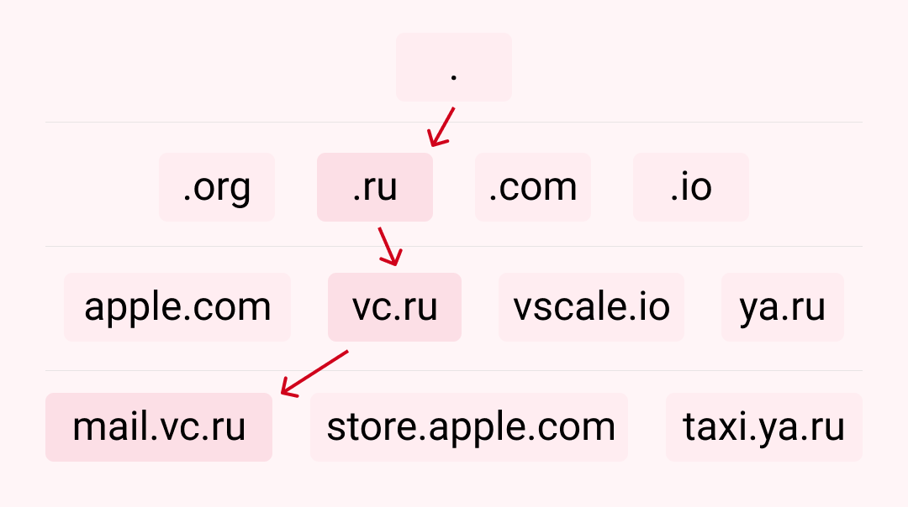

# 1. **Что происходит, когда я вбиваю в адресную строку моего браузера [google.com](https://www.google.com/)? Как запрос доходит до сервера, и как идет обратно? Гранулярность — настолько маленькая, насколько возможно.**
### 1. Пользователь вводит в браузере адрес сайта  
### 2. Браузер начинает искать сервер  
   За работу любого сайта обычно отвечает один из миллионов серверов, подключенных к интернету. Адрес сервера — это  уникальный набор цифр, который называется IP-адресом. Например, для vc.ru— это сервер 85.119.149.83  

   **Поэтому первым делом браузеру нужно понять, какой IP-адрес у сервера, на котором находится сайт.**  
   Такая информация хранится в распределенной системе серверов — DNS (Domain Name System). Система работает как общая «контактная книга», хранящаяся на распределенных серверах и устройствах в интернете. 

   Однако перед тем, как обращаться к DNS, браузер пытается найти запись об IP-адресе сайта в ближайших местах, чтобы сэкономить время:  

   - Сначала в своей **истории подключений**. Если пользователь уже посещал сайт, то в браузере могла сохраниться информация c IP-адресом сервера.  
   - В **операционной системе**. Не обнаружив информации у себя, браузер обращается к операционной системе, которая также могла сохранить у себя DNS-запись. Например, если подключение с сайтом устанавливалось через одно из установленных на компьютере приложений.  
   - В **кэше роутера**, который сохраняет информацию о последних соединениях, совершенных из локальной сети.
### 3. Браузер отправляет запрос к DNS-серверам
   Не обнаружив подходящих записей в кэше, браузер формирует запрос к DNS-серверам, расположенным в интернете.  
   Например, если нужно найти IP-адрес сайта mail.vc.ru, браузер спрашивает у ближайшего DNS-сервера «Какой IP-адрес у сайта mail.vc.ru?».  

   Сервер может ответить: «Я не знаю про mail.vc.ru, но знаю сервер, который отвечает за vc.ru». Запрос переадресовывается дальше, на сервер «выше», пока в итоге один из серверов не найдет ответ об IP-адресе для сайта.  

   
### 4. Браузер устанавливает соединение с сервером
   Как только браузер узнал IP-адрес нужного сервера, он пытается установить с ним соединение. В большинстве случаев для этого используется специальный протокол — TCP.

   TCP — это набор правил, который описывает способы соединения между устройствами, форматы отправки запросов, действия в случае потери данных и так далее.

   Например, для установки соединения между браузером и сервером в стандарте TCP используется система «трёх рукопожатий». Работает она так:  
   - Устройство пользователя отправляет специальный запрос на установку соединения с сервером — называется **SYN**-пакет.  
   - Сервер в ответ отправляет запрос с подтверждением получения SYN-пакета — называется **SYN/ACK**-пакет.  
   - В конце устройство пользователя при получении SYN/ACK-пакета отправляет пакет с подтверждением — **ACK**-пакет. В этот момент соединение считается установленным.
### 5. Браузер отправляет HTTP-запрос, чтобы получить контент сайта
   После установки соединения браузер отправляет специальный запрос, в котором просит сервер отправить данные для отображения страницы. В этом запросе содержится информация о самом браузере, временные файлы, требования к соединению и так далее.

   **Задача браузера — как можно подробнее объяснить серверу, какая именно информация ему нужна.**

   В общении браузера и сервера выделяют два типа запросов. GET-запрос используется для получения данных с сервера — например, отобразить картинку, текст или видео. POST-запрос — используется для отправки данных из браузера на сервер, например, когда пользователь отправляет сообщение, картинку или загружает файл.

    Почти все сайты обмениваются информацией с сервером в зашифрованном формате — с помощью HTTPS-протокола. В отличие от HTTP-протокола, в HTTPS используется шифрование, а безопасность подключения подтверждается специальным сертификатом.
### 6. Сервер обрабатывает запрос
   Сервер получил запрос от браузера с подробным описанием того, что ему требуется. Теперь ему нужно обработать этот запрос. Этой задачей занимается специальное серверное программное обеспечение — например, nginx или Apache. Чаще всего такие программы принято называть веб-серверами.

   Веб-сервер в свою очередь перенаправляет запрос на дальнейшую обработку к программе-обработчику — например: GO, PHP, Ruby или Python. Программа внимательно изучает содержимое запроса — например, понимает, в каком формате нужно отправить ответ и какие именно файлы нужны. И собирает ответ.
### 7. Сервер отправляет ответ браузеру
   Когда ответ сформирован, он отправляется веб-сервером обратно браузеру. В ответе как правило содержится контент для отображения веб-страницы, информация о типе сжатия данных, способах кэширования, файлы cookie, которые нужно записать и так далее.

    Чтобы обмен данными был быстрым, браузер и сервер обмениваются сразу множеством небольших пакетов данных — как правило, в пределах 8 КБ. Все пакеты имеют специальные номера, которые помогают отслеживать последовательность отправки и получения данных.
### 8. Браузер обрабатывает полученный ответ и «рисует» веб-страницу
   Браузер распаковывает полученный ответ и постепенно начинает отображать полученный контент на экране пользователя — этот процесс называется **рендерингом**.

   Сначала браузер загружает только основную структуру HTML-страницы. Затем последовательно проверяет все теги и отправляет дополнительные GET-запросы для получения с сервера различных элементов — картинки, файлы, скрипты, таблицы стилей и так далее. Поэтому по мере загрузки страницы браузер и сервер продолжают обмениваться между собой информацией.

   Параллельно с этим на компьютер как правило сохраняются статичные файлы пользователя — чтобы при следующем посещении не загружать их заново и быстрее отобразить пользователю содержимое страницы.

   Как только рендеринг завершен — пользователю отобразится полностью загруженная страница сайта.
# 2.  **В чем отличие протоколов TCP и UDP? В каком случае UDP предпочтительнее?**